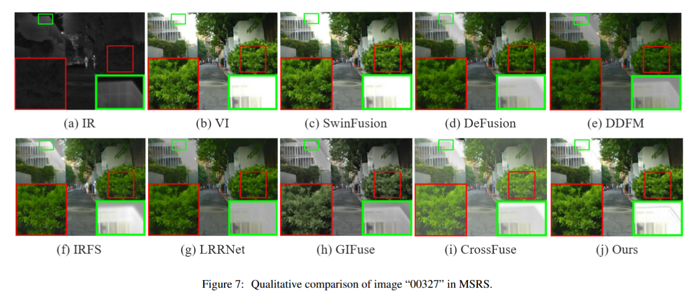
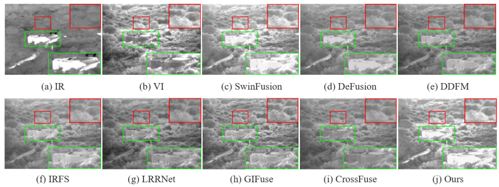
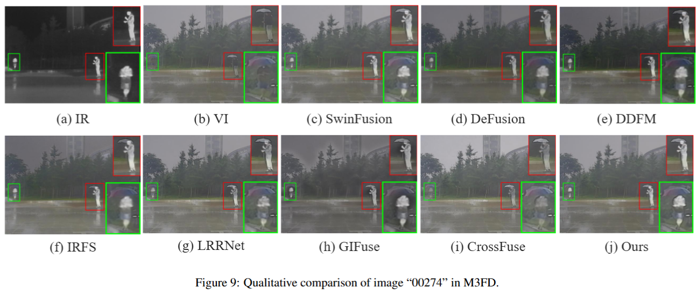

# The code of Conti-Fuse

## Environment

>  python 3.9
>
> setuptools == 59.5.0
>
> torch == 1.10.2
>
> matplotlib, pillow, qdm, pyyaml, kornia, torchvision
>
> cuda: 12.1

## Test on datasets

1. Modify the parameters related to the dataset and save path in `test.py`.
2. > python test.py
   >

## Training on your own datasets

1. Modify the parameters in the configuration yaml file.
2. Modify the parameters in `train.py`, including the dataset, number of samples, etc., and set them to the desired values.
3. > python test.py
   >

## Experiment Results

